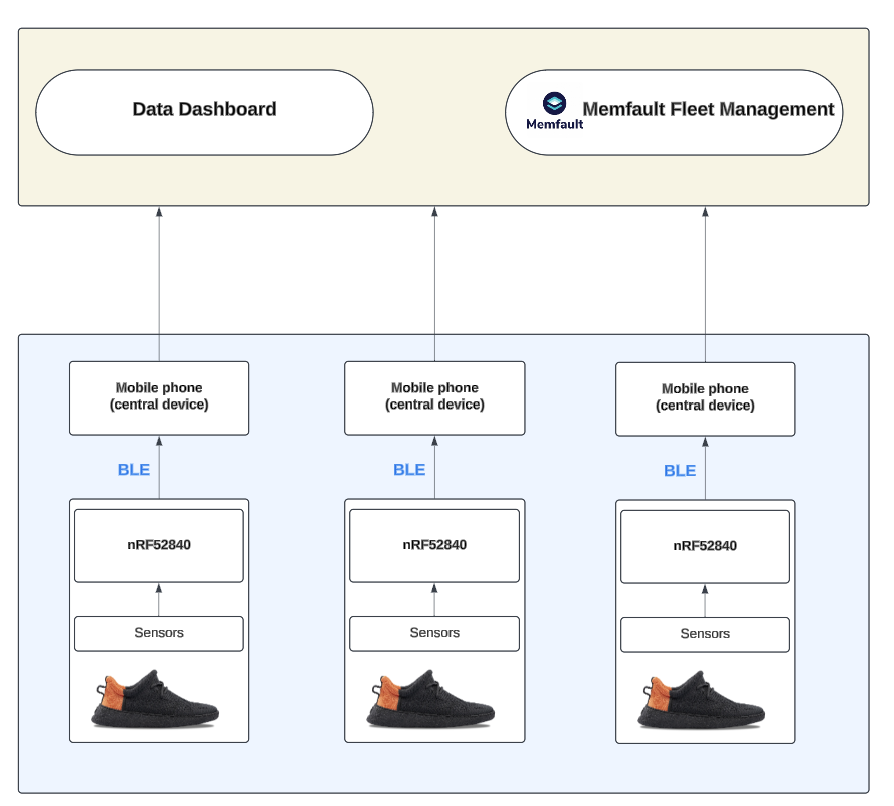

# Batteryless Gadgets (Smart Shoes)

| Team Member Name | Email Address       |
|------------------|---------------------|
| Truong (Winston) Nguyen   | truongng@seas.upenn.edu           |
| Mark Xia         | xuyaoxia@seas.upenn.edu          |

## 1. Product Overview

- The "Smart Shoes" product idea stems from the needs of analyzing gait movement data of professional athletes or stroke patients. Although available smart watches can track movement data like step counts, running speed, calories, they can not track feet pressure or highly accurate gait movement like embedded sensors in a pair of shoes.

- Additionally, as battery usage is a concern in using smart devices, the product innovates battery usage by **integrating thin film sensor to generate electric charges** when users walking or running. The generated charges can be used to charge the coin-cell battery, reducing the frequents of charging sensor module. The thin film sensor can also be used to record feet pressure.

## 2. Target Market & Demographics

- Initially, the product targeted at general users groups who all have needs like stroke patients/doctors, athletes, tech enthusiasts. However, each group has different expectations for the products and we also need to add medical considerations or products fits for the product to be used in medical field.

- That is why the target market is finally narrowed down to:
    - Target customer: athletes, sport players, those who focus more on gait movement tracking functionality.

    - Target geographic market: regions with high adoption rates of wearable tech and fitness products like North America, Europe, and Asia-Pacific.

- The current market analysis is as shown below:
     

    

     

## 3. Security, Hardware, & Software Requirements

### 3.1. Security Requirements:

SEC 01: User data shall not be easily tracked from transactions. All data transmissions will be anonymized to prevent tracking of individual users.

SEC 02: All data transmitted over BLE between the nRF52840 sensor module and the phone application shall use BLE encryption to prevent interception.

SEC 03: The system shall provide users with the ability to delete their data. Users can request data deletion through the smartphone app, and the system will securely erase the data from both local and cloud storage.

### 3.2. Hardware Requirements:

HRS 01: The project shall use the Nordic nRF52840 DK for its low power consumption (average power consumption should be around 68mW).

HRS 02: The BMI270 IMU shall be configured to measure 3-axis linear accelerations (X, Y, Z) in meters per second squared with a range of ±2g, a resolution of 16-bit, and a sampling frequency of 100 Hz. 
 
HRS 03: The BMI270 IMU shall measure 3-axis angular velocities (X, Y, Z) in degrees per second (dps) with a range of ±500 dps, a resolution of 16-bit, and a sampling frequency of 100 Hz

HRS 04: Two to three (2-3) piezoelectric thin films will be used to generate electric charges (eventually voltage) and to measure surface pressure.

HRS 05: The system should operate on PERFORMANCE mode for at least 24 hours every battery charge.

HRS 06: The system will include a rechargeable coin cell battery with a capacity of 500 mAh, providing at least 24 hours of continuous operation.

HRS 07: The system will integrate a power management circuit to efficiently manage battery charging process and power distribution.

HRS 08: The water-proof level should be IPX7, withstanding immersion in water up to 1 meter for 30 minutes.

### 3.3. Software Requirements:

SRS 01: The BMI270 IMU shall provide 16-bit resolution for both 3-axis linear accelerations and 3-axis angular velocities. The accelerometer scanning frequency shall be configurable between 12.5 Hz and 1600 Hz, while the gyroscope scanning frequency shall range between 25 Hz and 6400 Hz. The software shall dynamically manage the IMU's operating modes, switching between performance mode for high-frequency data acquisition and low-power mode to optimize battery usage.

SRS 02: The piezoelectric thin-film pressure sensors shall measure foot pressure at two points (front and heel) with a 16-bit resolution and a frequency range of 20 Hz to 60 Hz. The software shall process the pressure data for gait analysis while ensuring efficient energy usage.

SRS 03: The BLE module shall transmit aggregated sensor data, including 6-axis IMU data and foot pressure data to the paired smartphone application at regular intervals of 1 second ±100 milliseconds.

## 4. Product Function & Components

The device architecture for each "Smart Shoes" is shown below.

- Main peripherals include: BMI270 IMU and Piezoelectric thin films

- nRF52840 as main board and BLE peripheral device

- Smart phone as central BLE device
 

 

For multiple devives or fleet management, here is the overall system we use:

- Data from multiple shoes are sent to data cloud via BLE through a central smart phone as BLE gateway.

- Data cloud includes movement data (for further movement analysis) and Memfault fleet management for diagnostics services.
 

 

## 5. Power & Cost Budgeting

### 5.1. Power Budgeting

- nRF52840: 600nA for deep sleep, 1.2uA for sleep; 12mA for CPU active and 8mA for BLE transmission.

- BMI270: Devboard: A only LP mode: 10uA, A+G LP mode: 420uA

- Miscellaneous Power Consumption: 5-10% of total consumption.

- Given the devices operate at 3.3V:

    => Total Power = ~68mW MAX; ~28mW when BLE ON; 35uW when sleep.

### 5.2. Cost Budgeting

#### Manufacturing cost:

- nRF52840DK: $49

- BMI270: $14.5

- Piezoelectric Film: 2 x $30 = $60

- Rechargeable Coin Cell Battery: $5

- Miscellaneous Components: ~$20

- Shoe cost: $25/pair

    => Total: $150 - $160 per pair of shoes

#### Sale pricing model:

- One-time purchase: $300 - $350 for a pair of shoes with embedded sensor module 

- Subscription model for add-on services: extra annual fees (~$50-$70) for customized movement recommendation by AI/expert and sensor module replacement

## 6. What parts of your project would you consider a success? Why?

- Reduce the number of sensors usage: initially we used a separate sensor for temprature measurement; however, BMI270 IMU is a highly customized module for health tracking device. It also includes step counts, temperature, movement mode tracking so we only need to use this one sensor module. We can configure I2C to read data from BMI270 IMU using standard sensor API from Zephyr.

- Harvest energy from the thin film sensors: although it is mechanically to make a shoes demo with thin films sensors embedded, we use rectifier circuit and an LED to show the capability of 2 thin films to generate enough electricity to light up an LED with a voltage ar around 3V - 3.3V.

- Configure Memfault diagnostics service and send metrics via BLE: we are able to configure nRF52840 DKs to send device's key metrics to Memfault dashboard via BLE (using nRF Memfault as a gateway).

## 7. What parts of your project didn’t go well? Why?

- Energy harvest and integrate into the current design: to be able to smoothly use generated charge from thin films as they are bended when users walking, we need to design customized circuits to smooth out the voltage and stabilize the signal. This part is challenging and we had limited time to we were not able to demonstrate it clearly in the system. However, we did use a simplified circuit to show this system has the potential to use generated charges to power sensors.

- BLE configuration and limitations: BLE configuration on nRF52840 requires a middle gateway so it is difficult to control package loss when sending data. Furthermore, we notice BLE configuration is more challenging with limited documentation from both Memfault and Nordic, slowing down our development process.

## 8. If you had to do it again, how might you change your development approach given the finite time and money resources?

- We should focus on simple functionalities to make it work first, like configuring I2C for the BMI270 IMU. These commonly used configurations allow us to imagine more clearly how should we progress in the project.

- We also should make simplified prototype or functionalities of complex modules like the energy harvesting module. It is challenging to make a custom PCB to efficiently use the generated charges to power the system so making a simplified version to show fundamental functionalities should be a good start.

## 9. Would you change your system design after this development cycle? 

a. Was your wireless communication protocol the correct choice?

- BLE (Bluetooth Low Energy) is an excellent choice for the Smart Shoes project because it consumes minimal power, enabling extended battery life, which aligns with the piezoelectric charging innovation. 

- Additionally, BLE provides sufficient data throughput for transmitting sensor data (e.g., IMU data, pressure) efficiently and securely, while being widely compatible with smartphones for seamless integration with the paired app.

b. Would other sensors or actuators work better?

- No, the selected sensors work well. It is worth noting that the BMI270 IMU is an excellent choice and a great fit for smart health-tracking devices because it provides multiple types of data in addition to 6-axis motion, such as step counts, temperature, and movement states (running, walking, standing).

## 10. Images of MVP device

The image of MVP device is shown below.
 

 

## 11. Video demonstrating

### 11.a. Core Product Function

- This video demonstrates how the piezoelectric thin films can generate electric charges to power the system when the wearers bend the films: [Link video](https://drive.google.com/file/d/1CPHzt_Gev97sNJQHjCSZ0H0-o_8ZIVsV/view?usp=sharing).

    As shown in the video, as we bend thin film sensors:
    - the generated voltage increases to around 3.3V.

    - the generated voltage can power up the LED.

- This video shows we can successfully read 6-axis motion data from BMI270 IMU via I2C. Based on acceleration and rotational speed, we can calculate thr pitch and roll angle (rotating angles around X and Y axis): [Link video](https://drive.google.com/file/d/1McY1eZM6CfSS_6qaY8T28TQjX3qjfxI0/view?usp=sharing).

### 11.b. Memfault integration features

- This video shows Memfault integration features: [Link video](https://drive.google.com/file/d/1fQ9_-w_5nCxzl9DEccu8E78kCr0oCZEr/view?usp=sharing)

    - This is a payload content showing metrics sent to Memfault. For instance, battery_soc_pct reflects the change in the battery level given the use of thin film sensors.
         

        

         

- This video shows 2 devices working at the same time: [Link video](https://drive.google.com/file/d/1_KFAcxE6k_iEY0qE7J5oxXS-w5RNAS_k/view?usp=sharing)

